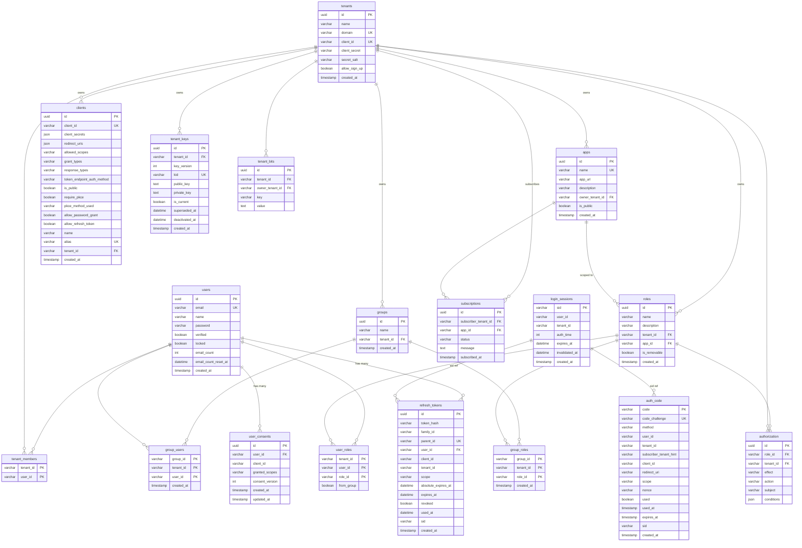

# Database Schema

Complete reference for all tables in the Auth Server database.

## Entity Relationship Diagram

## Tables

### users

Registered user accounts. Shared across all tenants — a user can be a member of multiple tenants.

| Column                 | Type         | Nullable | Default              | Constraint  |
|------------------------|--------------|----------|----------------------|-------------|
| `id`                   | UUID         | No       | `uuid_generate_v4()` | PRIMARY KEY |
| `email`                | VARCHAR(128) | No       | —                    | UNIQUE      |
| `name`                 | VARCHAR(128) | No       | —                    | —           |
| `password`             | VARCHAR      | No       | —                    | —           |
| `verified`             | BOOLEAN      | —        | `false`              | —           |
| `locked`               | BOOLEAN      | —        | `false`              | —           |
| `email_count`          | INTEGER      | —        | `0`                  | —           |
| `email_count_reset_at` | DATETIME     | Yes      | —                    | —           |
| `created_at`           | TIMESTAMP    | —        | `now()`              | —           |

---

### tenants

Tenant (organization) accounts. Each tenant has its own domain and legacy OAuth credentials.

| Column          | Type      | Nullable | Default              | Constraint  |
|-----------------|-----------|----------|----------------------|-------------|
| `id`            | UUID      | No       | `uuid_generate_v4()` | PRIMARY KEY |
| `name`          | VARCHAR   | No       | —                    | —           |
| `domain`        | VARCHAR   | No       | —                    | UNIQUE      |
| `client_id`     | VARCHAR   | No       | —                    | UNIQUE      |
| `client_secret` | VARCHAR   | No       | —                    | —           |
| `secret_salt`   | VARCHAR   | No       | —                    | —           |
| `allow_sign_up` | BOOLEAN   | No       | `false`              | —           |
| `created_at`    | TIMESTAMP | —        | `now()`              | —           |

---

### tenant_members

Join table linking users to tenants (many-to-many).

| Column      | Type    | Nullable | Constraint                     |
|-------------|---------|----------|--------------------------------|
| `tenant_id` | VARCHAR | No       | PRIMARY KEY, FK → `tenants.id` |
| `user_id`   | VARCHAR | No       | PRIMARY KEY, FK → `users.id`   |

---

### roles

Roles defined within a tenant, optionally scoped to a specific app.

| Column         | Type      | Nullable | Default              | Constraint                          |
|----------------|-----------|----------|----------------------|-------------------------------------|
| `id`           | UUID      | No       | `uuid_generate_v4()` | PRIMARY KEY                         |
| `name`         | VARCHAR   | No       | —                    | —                                   |
| `description`  | VARCHAR   | Yes      | —                    | —                                   |
| `tenant_id`    | VARCHAR   | No       | —                    | FK → `tenants.id`                   |
| `app_id`       | VARCHAR   | Yes      | —                    | FK → `apps.id` (SET NULL on delete) |
| `is_removable` | BOOLEAN   | No       | `true`               | —                                   |
| `created_at`   | TIMESTAMP | —        | `now()`              | —                                   |

---

### user_roles

Assigns roles to users within a tenant. The `from_group` flag indicates the assignment was inherited via a group.

| Column       | Type    | Nullable | Default | Constraint  |
|--------------|---------|----------|---------|-------------|
| `tenant_id`  | VARCHAR | No       | —       | PRIMARY KEY |
| `user_id`    | VARCHAR | No       | —       | PRIMARY KEY |
| `role_id`    | VARCHAR | No       | —       | PRIMARY KEY |
| `from_group` | BOOLEAN | No       | `false` | —           |

---

### groups

Named groups within a tenant, used to batch-assign roles to users.

| Column       | Type      | Nullable | Default              | Constraint                              |
|--------------|-----------|----------|----------------------|-----------------------------------------|
| `id`         | UUID      | No       | `uuid_generate_v4()` | PRIMARY KEY                             |
| `name`       | VARCHAR   | No       | —                    | UNIQUE per tenant (`tenant_id`, `name`) |
| `tenant_id`  | VARCHAR   | No       | —                    | FK → `tenants.id`                       |
| `created_at` | TIMESTAMP | —        | `now()`              | —                                       |

---

### group_users

Members of a group within a tenant.

| Column       | Type      | Nullable | Constraint                               |
|--------------|-----------|----------|------------------------------------------|
| `group_id`   | VARCHAR   | No       | PRIMARY KEY, FK → `groups.id`            |
| `tenant_id`  | VARCHAR   | No       | PRIMARY KEY, FK → `tenants.id` (CASCADE) |
| `user_id`    | VARCHAR   | No       | PRIMARY KEY, FK → `users.id` (CASCADE)   |
| `created_at` | TIMESTAMP | —        | —                                        |

---

### group_roles

Roles assigned to a group within a tenant.

| Column       | Type      | Nullable | Constraint                               |
|--------------|-----------|----------|------------------------------------------|
| `group_id`   | VARCHAR   | No       | PRIMARY KEY, FK → `groups.id` (CASCADE)  |
| `tenant_id`  | VARCHAR   | No       | PRIMARY KEY, FK → `tenants.id` (CASCADE) |
| `role_id`    | VARCHAR   | No       | PRIMARY KEY, FK → `roles.id`             |
| `created_at` | TIMESTAMP | —        | —                                        |

---

### apps

Applications registered by a tenant and made available for other tenants to subscribe to.

| Column            | Type      | Nullable | Default              | Constraint                  |
|-------------------|-----------|----------|----------------------|-----------------------------|
| `id`              | UUID      | No       | `uuid_generate_v4()` | PRIMARY KEY                 |
| `name`            | VARCHAR   | No       | —                    | UNIQUE                      |
| `app_url`         | VARCHAR   | No       | —                    | —                           |
| `description`     | VARCHAR   | Yes      | —                    | —                           |
| `owner_tenant_id` | VARCHAR   | No       | —                    | FK → `tenants.id` (CASCADE) |
| `is_public`       | BOOLEAN   | —        | `false`              | —                           |
| `created_at`      | TIMESTAMP | —        | `CURRENT_TIMESTAMP`  | —                           |

---

### subscriptions

Records a tenant's subscription to an app.

| Column                 | Type          | Nullable | Default              | Constraint                                        |
|------------------------|---------------|----------|----------------------|---------------------------------------------------|
| `id`                   | UUID          | No       | `uuid_generate_v4()` | PRIMARY KEY                                       |
| `subscriber_tenant_id` | VARCHAR       | No       | —                    | FK → `tenants.id` (CASCADE), UNIQUE with `app_id` |
| `app_id`               | VARCHAR       | No       | —                    | FK → `apps.id` (CASCADE)                          |
| `status`               | VARCHAR(64)   | No       | —                    | —                                                 |
| `message`              | VARCHAR(2048) | Yes      | —                    | —                                                 |
| `subscribed_at`        | TIMESTAMP     | —        | `CURRENT_TIMESTAMP`  | —                                                 |

**Unique constraint:** `UQ_subscription_tenant_app` on (`subscriber_tenant_id`, `app_id`)

---

### clients

OAuth client applications registered within a tenant.

| Column                       | Type        | Nullable | Default                 | Constraint                      |
|------------------------------|-------------|----------|-------------------------|---------------------------------|
| `id`                         | UUID        | No       | `uuid_generate_v4()`    | PRIMARY KEY                     |
| `client_id`                  | VARCHAR     | No       | —                       | UNIQUE (`UQ_clients_client_id`) |
| `client_secrets`             | JSON        | Yes      | —                       | —                               |
| `redirect_uris`              | JSON        | Yes      | —                       | —                               |
| `allowed_scopes`             | VARCHAR     | Yes      | —                       | —                               |
| `grant_types`                | VARCHAR     | Yes      | —                       | —                               |
| `response_types`             | VARCHAR     | Yes      | —                       | —                               |
| `token_endpoint_auth_method` | VARCHAR     | —        | `'client_secret_basic'` | —                               |
| `is_public`                  | BOOLEAN     | —        | `false`                 | —                               |
| `require_pkce`               | BOOLEAN     | —        | `false`                 | —                               |
| `pkce_method_used`           | VARCHAR     | Yes      | —                       | —                               |
| `allow_password_grant`       | BOOLEAN     | —        | `false`                 | —                               |
| `allow_refresh_token`        | BOOLEAN     | —        | `true`                  | —                               |
| `name`                       | VARCHAR     | Yes      | —                       | —                               |
| `alias`                      | VARCHAR     | Yes      | —                       | UNIQUE                          |
| `tenant_id`                  | VARCHAR(36) | No       | —                       | FK → `tenants.id` (CASCADE)     |
| `created_at`                 | TIMESTAMP   | —        | `now()`                 | —                               |

---

### tenant_keys

RSA key pairs used to sign and verify JWTs for a tenant. Supports key rotation via versioning.

| Column           | Type        | Nullable | Default              | Constraint                  |
|------------------|-------------|----------|----------------------|-----------------------------|
| `id`             | UUID        | No       | `uuid_generate_v4()` | PRIMARY KEY                 |
| `tenant_id`      | VARCHAR(36) | No       | —                    | FK → `tenants.id` (CASCADE) |
| `key_version`    | INTEGER     | No       | —                    | —                           |
| `kid`            | VARCHAR(64) | No       | —                    | UNIQUE                      |
| `public_key`     | TEXT        | No       | —                    | —                           |
| `private_key`    | TEXT        | No       | —                    | —                           |
| `is_current`     | BOOLEAN     | —        | `false`              | —                           |
| `superseded_at`  | DATETIME    | Yes      | —                    | —                           |
| `deactivated_at` | DATETIME    | Yes      | —                    | —                           |
| `created_at`     | TIMESTAMP   | —        | `now()`              | —                           |

---

### tenant_bits

Generic key-value storage scoped to a tenant, owned by another tenant (used for cross-tenant configuration).

| Column            | Type    | Nullable | Constraint                  |
|-------------------|---------|----------|-----------------------------|
| `id`              | UUID    | No       | PRIMARY KEY                 |
| `tenant_id`       | VARCHAR | No       | FK → `tenants.id` (CASCADE) |
| `owner_tenant_id` | VARCHAR | No       | FK → `tenants.id` (CASCADE) |
| `key`             | VARCHAR | No       | —                           |
| `value`           | TEXT    | No       | —                           |

**Unique constraint:** (`tenant_id`, `key`, `owner_tenant_id`)

---

### authorization

CASL policy rules — defines what actions a role can perform on a subject within a tenant.

| Column       | Type    | Nullable | Constraint             |
|--------------|---------|----------|------------------------|
| `id`         | UUID    | No       | PRIMARY KEY            |
| `role_id`    | VARCHAR | No       | FK → `roles.id`, INDEX |
| `tenant_id`  | VARCHAR | No       | FK → `tenants.id`      |
| `effect`     | ENUM    | No       | `ALLOW` / `DENY`       |
| `action`     | ENUM    | No       | —                      |
| `subject`    | VARCHAR | No       | —                      |
| `conditions` | JSON    | No       | —                      |

**Indexes:** on `role_id`; composite on (`role_id`, `tenant_id`)

---

### auth_code

Short-lived OAuth authorization codes issued during the authorization code flow.

| Column                   | Type         | Nullable | Default             | Constraint  |
|--------------------------|--------------|----------|---------------------|-------------|
| `code`                   | VARCHAR(16)  | No       | —                   | PRIMARY KEY |
| `code_challenge`         | VARCHAR      | No       | —                   | UNIQUE      |
| `method`                 | VARCHAR      | No       | —                   | —           |
| `user_id`                | VARCHAR      | No       | —                   | —           |
| `tenant_id`              | VARCHAR      | No       | —                   | —           |
| `subscriber_tenant_hint` | VARCHAR      | Yes      | —                   | —           |
| `client_id`              | VARCHAR      | No       | `''`                | —           |
| `redirect_uri`           | VARCHAR      | Yes      | —                   | —           |
| `scope`                  | VARCHAR      | Yes      | —                   | —           |
| `nonce`                  | VARCHAR(512) | Yes      | —                   | —           |
| `used`                   | BOOLEAN      | No       | `false`             | —           |
| `used_at`                | TIMESTAMP    | Yes      | —                   | —           |
| `expires_at`             | TIMESTAMP    | No       | `CURRENT_TIMESTAMP` | —           |
| `sid`                    | VARCHAR(36)  | Yes      | —                   | —           |
| `created_at`             | TIMESTAMP    | —        | `now()`             | —           |

---

### refresh_tokens

Refresh token rotation chains. Each token records its parent to detect reuse attacks.

| Column                | Type        | Nullable | Default              | Constraint                              |
|-----------------------|-------------|----------|----------------------|-----------------------------------------|
| `id`                  | UUID        | No       | `uuid_generate_v4()` | PRIMARY KEY                             |
| `token_hash`          | VARCHAR     | No       | —                    | INDEX (`IDX_refresh_tokens_token_hash`) |
| `family_id`           | VARCHAR(36) | No       | —                    | INDEX (`IDX_refresh_tokens_family_id`)  |
| `parent_id`           | VARCHAR(36) | Yes      | —                    | UNIQUE (`UQ_refresh_tokens_parent_id`)  |
| `user_id`             | VARCHAR(36) | No       | —                    | FK → `users.id` (CASCADE)               |
| `client_id`           | VARCHAR     | No       | —                    | —                                       |
| `tenant_id`           | VARCHAR(36) | No       | —                    | —                                       |
| `scope`               | VARCHAR     | No       | —                    | —                                       |
| `absolute_expires_at` | DATETIME    | No       | —                    | —                                       |
| `expires_at`          | DATETIME    | No       | —                    | —                                       |
| `revoked`             | BOOLEAN     | —        | `false`              | —                                       |
| `used_at`             | DATETIME    | Yes      | —                    | —                                       |
| `sid`                 | VARCHAR(36) | Yes      | —                    | INDEX (`IDX_refresh_tokens_sid`)        |
| `created_at`          | TIMESTAMP   | —        | `now()`              | —                                       |

---

### login_sessions

Authenticated user sessions. The `sid` is embedded in auth codes and refresh tokens to link them back to the originating
session.

| Column           | Type        | Nullable | Default | Constraint                             |
|------------------|-------------|----------|---------|----------------------------------------|
| `sid`            | VARCHAR(36) | No       | —       | PRIMARY KEY                            |
| `user_id`        | VARCHAR(36) | No       | —       | INDEX (`IDX_login_sessions_user_id`)   |
| `tenant_id`      | VARCHAR(36) | No       | —       | INDEX (`IDX_login_sessions_tenant_id`) |
| `auth_time`      | INTEGER     | No       | —       | —                                      |
| `expires_at`     | DATETIME    | No       | —       | —                                      |
| `invalidated_at` | DATETIME    | Yes      | —       | —                                      |
| `created_at`     | TIMESTAMP   | —        | `now()` | —                                      |

---

### user_consents

Records the OAuth scopes a user has explicitly consented to for a given client.

| Column            | Type        | Nullable | Default              | Constraint                                                     |
|-------------------|-------------|----------|----------------------|----------------------------------------------------------------|
| `id`              | UUID        | No       | `uuid_generate_v4()` | PRIMARY KEY                                                    |
| `user_id`         | VARCHAR(36) | No       | —                    | INDEX (`IDX_user_consents_user_id`), FK → `users.id` (CASCADE) |
| `client_id`       | VARCHAR     | No       | —                    | INDEX (`IDX_user_consents_client_id`)                          |
| `granted_scopes`  | VARCHAR     | No       | —                    | —                                                              |
| `consent_version` | INTEGER     | No       | `1`                  | —                                                              |
| `created_at`      | TIMESTAMP   | —        | `now()`              | —                                                              |
| `updated_at`      | TIMESTAMP   | —        | `now()`              | —                                                              |

**Unique constraint:** `UQ_user_consents_user_client` on (`user_id`, `client_id`)
